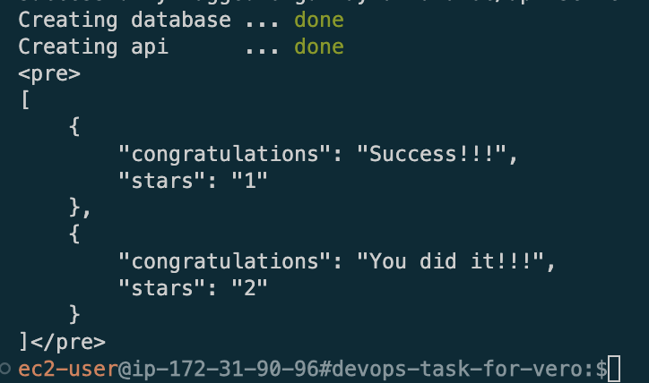

# Hello Dear Vero Developer Team!

## Running the assignment

### Application has done as how developer team intended. After pull process, enter devops-task-for-vero folder and run shell script as below.

```bash
./run-app.sh 
```
---
### When script process will be done,shell will respond as below on screenshot.

----
# Errors

The way of the solution was slightly challanging. while on the way i bumped several errors would like to mention about sequentially.

## 1. SQLSTATE[08001]: [Microsoft][ODBC Driver 18 for SQL Server]SSL Provider: [error:0A000086:SSL routines::certificate verify failed:self-signed certificate] 
- when this error occurred, i researched why it could be ,then found the reason is QuickDbTest.php file needs "trust_server_sertificate = true" state on connection process via odbc driver on "dsn" command line.

## before 
QuickDbTest.php
```bash
$dsn = "sqlsrv:server=".self::host.";Database=".self::db;
```
## after
```bash
$dsn = "sqlsrv:server=".self::host.";Database=".self::db.";TrustServerCertificate=true";
```
source: https://stackoverflow.com/questions/71688125/odbc-driver-18-for-sql-serverssl-provider-error1416f086

## 2. SQLSTATE[HYT00]: [Microsoft][ODBC Driver 18 for SQL Server]Login timeout expired.
- This issue occurrs when you re not launching Mssql and API app on different IP's so app ve to be on the same host with MsSQL therefore i changed containers network type bridge to HOST.Changes re visible on docker-compose.yml

source: https://forums.docker.com/t/mssql-login-timeout-error/134276/8

## 3. SQLSTATE[42000]: [Microsoft][ODBC Driver 18 for SQL Server][SQL Server]Cannot open database "db_vero_digital" requested by the login. The login failed
- Even QuickDbTest.php given by your development team it wasnt enough for having response from database. i had to add inital database by this reason as you can see parent folder of database in db.sql. After all of this preparetion i configured database Dockerfile and embedded initial database in database app

